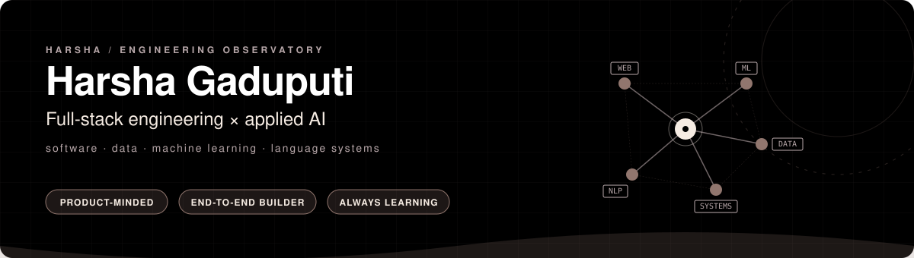

<div align="center">



<br />


<br />

<a href="https://github.com/HarshaGaduputi?tab=repositories">
  
</a>
<a href="https://www.linkedin.com/in/harsha-chowdary-8a2182324/">
  
</a>
<a href="mailto:harshagaduputi0903@gmail.com">
  
</a>

<br /><br />

<a href="https://github.com/HarshaGaduputi?tab=followers">
  
</a>
<a href="https://github.com/HarshaGaduputi?tab=stars">
  
</a>


</div>

<br />

## ◼ 01 / PROFILE

<table>
<tr>
<td width="64%" valign="top">

**Harsha Gaduputi**

**B.Tech Computer Science and Engineering**  
Amrita Vishwa Vidyapeetham, Coimbatore  
Class of 2028

**Direction:** Full-stack engineering and applied AI

I build complete, usable systems — from responsive interfaces and APIs to data pipelines, machine-learning workflows and semantic retrieval. 

I enjoy the point where software engineering meets applied AI. 

I am looking for software-engineering and applied AI opportunities including internships and future entry-level roles.

</td>
<td width="36%" valign="top">

### SYSTEM / STATUS

`STATUS` **ACTIVE**  
`FOCUS` **FULL-STACK + AI**  
`INTEREST` **ML / NLP**  
`MODE` **BUILD → TEST → ITERATE**  
`TARGET` **SWE / APPLIED AI**

</td>
</tr>
</table>

<br />

<table>
<tr>
<td width="25%" align="center">
<b>BUILD</b><br />
<sub>Product Engineering</sub>
</td>
<td width="25%" align="center">
<b>ANALYZE</b><br />
<sub>Machine Learning</sub>
</td>
<td width="25%" align="center">
<b>INTELLIGENCE</b><br />
<sub>NLP / Retrieval</sub>
</td>
<td width="25%" align="center">
<b>EXPLORE</b><br />
<sub>Algorithms / Systems</sub>
</td>
</tr>
</table>

<br />

---

## ◼ 02 / GITHUB ACTIVITY

<div align="center">


<br />
<br />


</div>

<br />

---

## ◼ 03 / SELECTED SYSTEMS

<table>
<tr>
<td width="50%" valign="top">


### [SimplLife](https://github.com/HarshaGaduputi/SimplLife)

Premium full-stack task-management web app that organises work by Groups — people or categories.

<br />

- AI subtask splitting using `gpt-4o-mini`
- 50-step undo / redo
- priorities & due-date chips
- responsive light / dark UI

<br />

   

<br /><br />

<details>
<summary><b>Open engineering notes</b></summary>
<br />

**Highlights:**
- subtasks, templates
- rule-based fallback
- calendar view
- recycle bin, soft-delete / restore
- activity log
- JSON export / import
- daily digest email
- keyboard shortcuts

**Extended Stack:**
React, TypeScript, Vite, Tailwind CSS, Zustand, React Router, Node.js, Express, PostgreSQL, JWT, Nodemailer, OpenAI, Vercel
</details>

</td>
<td width="50%" valign="top">


### [Urban Energy Efficiency](https://github.com/HarshaGaduputi/Machine-Learning-Case-Study)

Collaborative end-to-end ML case study on 75,757 US buildings with 64 features predicting Site Energy Use Intensity, plus a classification track.

<br />

- `Random Forest test R²: 0.5029`
- `Random Forest CV R²: 0.5566 ± 0.0105`
- `KNN accuracy: 76.45%`
- `Decision Tree ROC-AUC: 0.8501`

<br />

  

<br /><br />

<details>
<summary><b>Open engineering notes</b></summary>
<br />

**Verified facts:**
- 10 regression algorithms
- 5 classification algorithms

**Techniques:**
log transformation, IQR outlier capping, feature engineering, GridSearchCV, cross-validation

**Extended Stack:**
Python, pandas, NumPy, scikit-learn, Matplotlib, Seaborn, Jupyter
</details>

</td>
</tr>
<tr>
<td width="50%" valign="top">


### [Website AI Agent](https://github.com/HarshaGaduputi/Team_Finishers_E101A)

AI agent for a company website that crawls content, builds a vector index and maps natural-language requests to relevant pages.

<br />

- `all-MiniLM-L6-v2` embeddings
- `ChromaDB` vector storage
- cosine similarity ranking
- confidence-gated `Playwright` navigation

<br />

  

<br /><br />

<details>
<summary><b>Open architecture</b></summary>
<br />

```text
Website
  ↓
Crawler
  ↓
Content Extraction
  ↓
Sentence Embeddings
  ↓
ChromaDB
  ↓
Similarity Search
  ↓
Confidence Gate
  ↓
Playwright
```

**Extended Stack:**
Python, Sentence Transformers, ChromaDB, Playwright
</details>

</td>
<td width="50%" valign="top">


### [NLP Lab](https://github.com/HarshaGaduputi/NLP)

Language-processing experiments and utilities.

<br />

- n-gram language modelling
- PDF glossary extraction
- configurable translation backends
- structured JSON / Markdown outputs

<br />


<br /><br />

<details>
<summary><b>Open engineering notes</b></summary>
<br />

**Extended Stack:**
Python
</details>

</td>
</tr>
</table>

<br />

---

## ◼ 04 / ENGINEERING LOOP

I enjoy understanding complete systems instead of just isolated components. My process usually follows a disciplined engineering loop:

<div align="center">

```text
       IDEA
        ↓
     PROBLEM
        ↓
  SYSTEM DESIGN
        ↓
      BUILD
   ↙    ↓    ↘
INTERFACE  BACKEND  INTELLIGENCE
        ↓
       TEST
        ↓
     MEASURE
        ↓
     ITERATE
```

</div>

<br />

---

## ◼ 05 / TOOLCHAIN

<div align="center">

        

</div>

<br />

<details>
<summary><b>Open complete technical matrix</b></summary>
<br />

<table>
<tr>
<td width="25%" valign="top">
<b>WEB</b><br />
React<br />
TypeScript<br />
Node.js<br />
Express<br />
PostgreSQL<br />
REST<br />
JWT<br />
Zustand<br />
Tailwind CSS<br />
Vite
</td>
<td width="25%" valign="top">
<b>MACHINE LEARNING</b><br />
pandas<br />
NumPy<br />
scikit-learn<br />
EDA<br />
feature engineering<br />
regression<br />
classification<br />
cross-validation
</td>
<td width="25%" valign="top">
<b>NLP / RETRIEVAL</b><br />
Sentence Transformers<br />
embeddings<br />
semantic search<br />
ChromaDB<br />
n-gram models
</td>
<td width="25%" valign="top">
<b>TOOLS / SYSTEMS</b><br />
Git<br />
GitHub<br />
Docker<br />
Playwright<br />
ESLint<br />
Prettier<br />
Java<br />
eXpOS<br />
SPL<br />
XSM
</td>
</tr>
</table>
</details>

<br />

---

## ◼ 06 / FOUNDATIONS

<table>
<tr>
<td width="50%" valign="top">

### [LightUp Akari — Divide & Conquer](https://github.com/HarshaGaduputi/LightUp-Akari-_Divide_-_Conquer)

Java puzzle implementation with a solver, game model, execution traces and presentation material.

`Java` `Divide & Conquer` `Algorithm Design`

</td>
<td width="50%" valign="top">

### [eXpOS Case Study](https://github.com/HarshaGaduputi/My-Expos-Case-Study)

Ten-stage operating-systems coursework using SPL and the XSM machine model.

`Operating Systems` `SPL` `XSM`

</td>
</tr>
</table>

<br />

---

## ◼ 07 / CURRENT SIGNAL

<div align="center">

`SOFTWARE ENGINEERING` **+** `APPLIED AI`<br />
↓<br />
**PRODUCT-ORIENTED INTELLIGENT SYSTEMS**

<br />

<sub>Machine Learning · NLP · Embeddings · Semantic Retrieval · Automation · Systems</sub>

</div>

<br />

---

## ◼ 08 / EXPERIMENT LOG

<details>
<summary><b>Machine Learning</b></summary>
<br />
Actively exploring regression, classification, and feature engineering to solve data-driven problems. Focusing on building reliable models and validating them thoroughly through cross-validation and EDA.
</details>

<details>
<summary><b>NLP & Retrieval</b></summary>
<br />
Experimenting with semantic search, embedding models, and vector stores to build intelligent retrieval systems and agents that can understand natural language.
</details>

<details>
<summary><b>Software Engineering</b></summary>
<br />
Building robust, end-to-end full-stack applications with a focus on usability, scalable backend architecture, and seamless integrations.
</details>

<br />

---

<div align="center">

### BUILD SOMETHING USEFUL.

I am looking for software-engineering and applied AI opportunities where I can contribute across the stack, learn quickly and build thoughtful systems.

<br />

<a href="mailto:harshagaduputi0903@gmail.com">
  
</a>
<a href="https://www.linkedin.com/in/harsha-chowdary-8a2182324/">
  
</a>
<a href="https://github.com/HarshaGaduputi?tab=repositories">
  
</a>

<br /><br />

`BUILD → TEST → MEASURE → LEARN → ITERATE`

</div>
